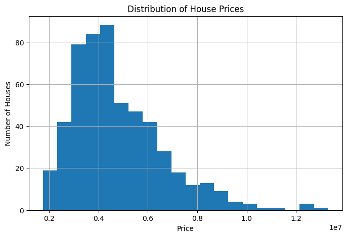
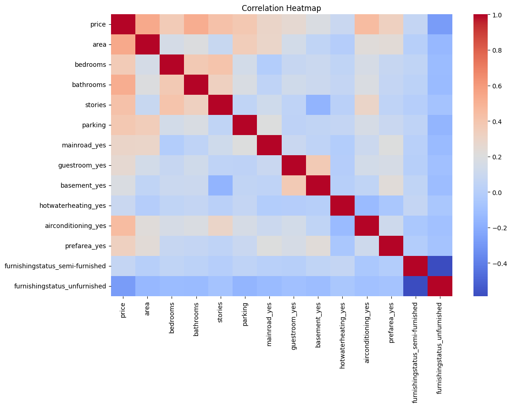
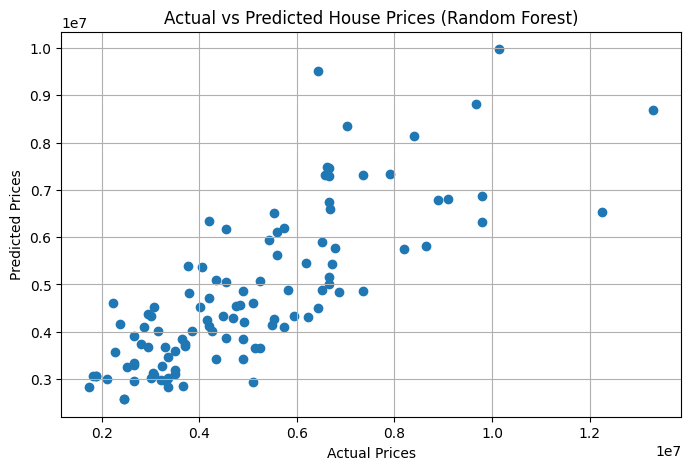

# House Price Prediction Using Machine Learning

## Overview

This project focuses on predicting house prices using machine learning techniques. The dataset was obtained from Kaggle and analyzed using Python in Google Colab. The workflow includes data exploration, preprocessing, model training, evaluation, visualization, and interpretation of results.

## Objectives

* Load and explore the housing dataset.
* Clean and preprocess the data.
* Convert categorical variables into numerical format.
* Train and evaluate regression models.
* Visualize relationships between features and house prices.
* Generate insights and recommendations based on the results.

## Dataset

The dataset contains information about houses, including:

* Area
* Bedrooms
* Bathrooms
* Stories
* Parking
* Main Road Access
* Guest Room
* Basement
* Hot Water Heating
* Air Conditioning
* Preferred Area
* Furnishing Status
* Price (Target Variable)

## Project Workflow

### Task 1: Data Loading & Exploration

* Loaded the dataset using Pandas.
* Displayed the first 10 rows.
* Checked dataset dimensions.
* Identified features and target variable.
* Checked for missing values.

### Task 2: Data Cleaning

* Verified that there were no missing values.
* Verified that there were no duplicate rows.
* Converted categorical variables into numerical format using One-Hot Encoding.
* Prepared the dataset for machine learning models.

### Task 3: Model Building

Two regression models were trained:

#### Linear Regression

* Simple and interpretable regression model.
* Used as the baseline model.

#### Random Forest Regressor

* Ensemble learning model based on multiple decision trees.
* Used to compare performance against Linear Regression.

### Evaluation Metrics

The following metrics were used:

* MAE (Mean Absolute Error)
* RMSE (Root Mean Squared Error)
* R² Score

## Results

| Model                   |       MAE |      RMSE | R² Score |
| ----------------------- | --------: | --------: | -------: |
| Linear Regression       |   970,043 | 1,324,507 |    0.653 |
| Random Forest Regressor | 1,021,546 | 1,400,566 |    0.612 |

### Best Performing Model

**Linear Regression**

The Linear Regression model achieved:

* Lower MAE
* Lower RMSE
* Higher R² Score

Compared to the Random Forest Regressor, Linear Regression produced more accurate predictions on this dataset.

## Visualizations

The project includes:

1. Distribution of House Prices (Histogram)
2. Correlation Heatmap
3. Actual vs Predicted House Prices Scatter Plot
4. House Price vs Area Scatter Plot (Optional)

## Key Findings

* Area is one of the strongest factors affecting house prices.
* Bathrooms, stories, parking availability, and furnishing status also influence pricing.
* The dataset showed a largely linear relationship between features and price.
* Linear Regression performed better than Random Forest for this specific dataset.

## Technologies Used

* Python
* Pandas
* NumPy
* Scikit-learn
* Matplotlib
* Seaborn
* Google Colab

